# RAINY OpenClaw Implementation Plan

> **Goal**: Enable cloud-based AI agents (via Telegram/WhatsApp) to access local workspace files on the user's desktop through a secure command bridge.

---

## 🏗️ Architecture Overview

```mermaid
sequenceDiagram
    participant User as 📱 Telegram/WhatsApp
    participant Cloud as ☁️ rainy-atm (Cloud Run)
    participant LLM as 🧠 Rainy API (Gemini)
    participant Desktop as 🖥️ Tauri App

    User->>Cloud: "Read my notes.md file"
    Cloud->>LLM: Chat + Tools Definition
    LLM-->>Cloud: tool_call: read_file("notes.md")
    Cloud->>Cloud: Queue command to desktop_node
    Cloud-->>User: "⏳ Reading file..."

    loop Polling (every 2s)
        Desktop->>Cloud: GET /nodes/:id/commands
        Cloud-->>Desktop: [pending command]
    end

    Desktop->>Desktop: Execute file read
    Desktop->>Cloud: POST /commands/:id/complete
    Cloud->>LLM: Continue with tool result
    LLM-->>Cloud: Final response
    Cloud-->>User: "Here's your notes.md content..."
```



---

## 📦 Components to Build

### Phase 1: Tool Definitions for LLM

Define OpenAI-compatible function tools that the agent can call:

```typescript
// rainy-atm/src/tools/workspace-tools.ts

export const WORKSPACE_TOOLS = [
  {
    type: "function",
    function: {
      name: "read_file",
      description: "Read the contents of a file from the user's workspace",
      parameters: {
        type: "object",
        properties: {
          path: {
            type: "string",
            description: "Relative path to the file within the workspace",
          },
        },
        required: ["path"],
      },
    },
  },
  {
    type: "function",
    function: {
      name: "write_file",
      description: "Write or update a file in the user's workspace",
      parameters: {
        type: "object",
        properties: {
          path: { type: "string", description: "Relative path for the file" },
          content: { type: "string", description: "Content to write" },
        },
        required: ["path", "content"],
      },
    },
  },
  {
    type: "function",
    function: {
      name: "list_files",
      description: "List files and directories in the workspace",
      parameters: {
        type: "object",
        properties: {
          path: {
            type: "string",
            description: "Directory path (default: root)",
            default: ".",
          },
          recursive: {
            type: "boolean",
            description: "Include subdirectories",
            default: false,
          },
        },
      },
    },
  },
  {
    type: "function",
    function: {
      name: "search_files",
      description: "Search for files by name or content pattern",
      parameters: {
        type: "object",
        properties: {
          query: {
            type: "string",
            description: "Search query (glob or regex)",
          },
          searchContent: {
            type: "boolean",
            description: "Search inside file contents",
            default: false,
          },
        },
        required: ["query"],
      },
    },
  },
];
```

---

### Phase 2: Modify Agent Executor

Update `agent-executor.ts` to:

1. Include tools in LLM request
2. Handle `tool_calls` in response
3. Queue commands to desktop node
4. Wait for results and continue conversation

```typescript
// rainy-atm/src/services/agent-executor.ts (modifications)

import { WORKSPACE_TOOLS } from "../tools/workspace-tools";
import { CommandBridge } from "./command-bridge";

// In execute() method:
async execute(config: AgentConfig): Promise<AgentResult> {
  const { workspaceId, nodeId, messages, systemPrompt } = config;

  // Check if desktop node is online
  const nodeOnline = await this.isNodeOnline(workspaceId);
  const tools = nodeOnline ? WORKSPACE_TOOLS : undefined;

  // Build LLM request with tools
  const response = await this.callLLM({
    messages: [{ role: "system", content: systemPrompt }, ...messages],
    tools,
    tool_choice: nodeOnline ? "auto" : undefined,
  });

  // Handle tool calls
  if (response.choices[0].message.tool_calls) {
    return this.handleToolCalls(response, config);
  }

  return { content: response.choices[0].message.content };
}

private async handleToolCalls(response: LLMResponse, config: AgentConfig) {
  const toolCalls = response.choices[0].message.tool_calls;
  const results: ToolResult[] = [];

  for (const toolCall of toolCalls) {
    const result = await CommandBridge.executeOnDesktop({
      workspaceId: config.workspaceId,
      skill: "filesystem",
      method: toolCall.function.name,
      params: JSON.parse(toolCall.function.arguments),
      timeout: 30000, // 30s timeout
    });

    results.push({
      tool_call_id: toolCall.id,
      role: "tool",
      content: JSON.stringify(result),
    });
  }

  // Continue conversation with tool results
  return this.execute({
    ...config,
    messages: [
      ...config.messages,
      response.choices[0].message,
      ...results,
    ],
  });
}
```

---

### Phase 3: Command Bridge Service

New service to manage command queue and async execution:

```typescript
// rainy-atm/src/services/command-bridge.ts

import { db } from "../db/client";
import { nanoid } from "nanoid";

export interface CommandRequest {
  workspaceId: string;
  skill: string; // e.g., "filesystem"
  method: string; // e.g., "read_file"
  params: Record<string, unknown>;
  timeout?: number;
  priority?: "high" | "normal" | "low";
}

export interface CommandResult {
  success: boolean;
  data?: unknown;
  error?: string;
}

export class CommandBridge {
  private static readonly POLL_INTERVAL = 500; // ms
  private static readonly DEFAULT_TIMEOUT = 30000; // 30s

  /**
   * Execute a command on the desktop node and wait for result
   */
  static async executeOnDesktop(
    request: CommandRequest,
  ): Promise<CommandResult> {
    const {
      workspaceId,
      skill,
      method,
      params,
      timeout = this.DEFAULT_TIMEOUT,
      priority = "high",
    } = request;

    // 1. Find online desktop node for workspace
    const node = await this.findOnlineNode(workspaceId);
    if (!node) {
      return {
        success: false,
        error: "Desktop is offline. Please ensure Rainy Cowork is running.",
      };
    }

    // 2. Queue command
    const commandId = `cmd_${nanoid(12)}`;
    await db.execute({
      sql: `
        INSERT INTO command_queue (id, workspace_id, desktop_node_id, intent, payload, airlock_level, priority, status, created_at)
        VALUES (?, ?, ?, ?, ?, ?, ?, 'pending', ?)
      `,
      args: [
        commandId,
        workspaceId,
        node.id,
        `${skill}.${method}`,
        JSON.stringify({ skill, method, params }),
        this.getAirlockLevel(method),
        priority,
        Date.now(),
      ],
    });

    console.log(`[CommandBridge] Queued: ${skill}.${method} -> ${node.id}`);

    // 3. Poll for completion
    return this.waitForResult(commandId, timeout);
  }

  /**
   * Poll database for command completion
   */
  private static async waitForResult(
    commandId: string,
    timeout: number,
  ): Promise<CommandResult> {
    const startTime = Date.now();

    while (Date.now() - startTime < timeout) {
      const result = await db.execute({
        sql: `SELECT status, result FROM command_queue WHERE id = ?`,
        args: [commandId],
      });

      if (result.rows.length === 0) {
        return { success: false, error: "Command not found" };
      }

      const { status, result: resultJson } = result.rows[0];

      if (status === "completed") {
        const data = JSON.parse(resultJson as string);
        return { success: true, data: data.output };
      }

      if (status === "failed") {
        const data = JSON.parse(resultJson as string);
        return { success: false, error: data.error };
      }

      if (status === "rejected") {
        return {
          success: false,
          error: "Command was rejected by user (Airlock denied)",
        };
      }

      // Wait before next poll
      await new Promise((resolve) => setTimeout(resolve, this.POLL_INTERVAL));
    }

    // Timeout - mark command as failed
    await db.execute({
      sql: `UPDATE command_queue SET status = 'timeout' WHERE id = ?`,
      args: [commandId],
    });

    return { success: false, error: "Desktop did not respond in time" };
  }

  /**
   * Determine Airlock level based on operation
   */
  private static getAirlockLevel(method: string): number {
    // Read operations = low risk
    if (["read_file", "list_files", "search_files"].includes(method)) {
      return 0; // No approval needed
    }
    // Write operations = medium risk
    if (["write_file", "create_file"].includes(method)) {
      return 1; // Show in UI, can be auto-approved
    }
    // Delete/execute = high risk
    if (["delete_file", "execute_command"].includes(method)) {
      return 2; // Requires explicit approval
    }
    return 1;
  }

  /**
   * Find an online desktop node for the workspace
   */
  private static async findOnlineNode(workspaceId: string) {
    const result = await db.execute({
      sql: `
        SELECT id, hostname, skills_manifest 
        FROM desktop_nodes 
        WHERE workspace_id = ? AND status = 'online'
        ORDER BY last_heartbeat DESC
        LIMIT 1
      `,
      args: [workspaceId],
    });

    return result.rows[0] || null;
  }
}
```

---

### Phase 4: Desktop Node - Skill Executor

Update the Tauri app to execute filesystem commands:

```rust
// src-tauri/src/services/skill_executor.rs

use std::path::PathBuf;
use serde::{Deserialize, Serialize};

#[derive(Debug, Deserialize)]
pub struct SkillCommand {
    pub skill: String,
    pub method: String,
    pub params: serde_json::Value,
}

#[derive(Debug, Serialize)]
pub struct SkillResult {
    pub success: bool,
    pub output: Option<serde_json::Value>,
    pub error: Option<String>,
}

pub struct SkillExecutor {
    workspace_path: PathBuf,
}

impl SkillExecutor {
    pub fn new(workspace_path: PathBuf) -> Self {
        Self { workspace_path }
    }

    pub async fn execute(&self, command: SkillCommand) -> SkillResult {
        match command.skill.as_str() {
            "filesystem" => self.execute_filesystem(command.method, command.params).await,
            _ => SkillResult {
                success: false,
                output: None,
                error: Some(format!("Unknown skill: {}", command.skill)),
            },
        }
    }

    async fn execute_filesystem(&self, method: String, params: serde_json::Value) -> SkillResult {
        match method.as_str() {
            "read_file" => {
                let path = params["path"].as_str().unwrap_or("");
                let full_path = self.workspace_path.join(path);

                // Security: Ensure path is within workspace
                if !full_path.starts_with(&self.workspace_path) {
                    return SkillResult {
                        success: false,
                        output: None,
                        error: Some("Path traversal not allowed".into()),
                    };
                }

                match tokio::fs::read_to_string(&full_path).await {
                    Ok(content) => SkillResult {
                        success: true,
                        output: Some(serde_json::json!({ "content": content })),
                        error: None,
                    },
                    Err(e) => SkillResult {
                        success: false,
                        output: None,
                        error: Some(e.to_string()),
                    },
                }
            }
            "list_files" => {
                let path = params["path"].as_str().unwrap_or(".");
                let recursive = params["recursive"].as_bool().unwrap_or(false);
                let full_path = self.workspace_path.join(path);

                // Implementation...
                todo!("Implement list_files")
            }
            "write_file" => {
                let path = params["path"].as_str().unwrap_or("");
                let content = params["content"].as_str().unwrap_or("");
                let full_path = self.workspace_path.join(path);

                // Security check + write implementation...
                todo!("Implement write_file")
            }
            _ => SkillResult {
                success: false,
                output: None,
                error: Some(format!("Unknown filesystem method: {}", method)),
            },
        }
    }
}
```

---

### Phase 5: Desktop Polling Service

Service that polls cloud for pending commands:

```rust
// src-tauri/src/services/command_poller.rs

use std::time::Duration;
use tokio::time::interval;

pub struct CommandPoller {
    api_base: String,
    node_id: String,
    platform_key: String,
    skill_executor: SkillExecutor,
}

impl CommandPoller {
    pub async fn start(&self) {
        let mut interval = interval(Duration::from_secs(2));

        loop {
            interval.tick().await;

            if let Err(e) = self.poll_and_execute().await {
                eprintln!("[CommandPoller] Error: {}", e);
            }
        }
    }

    async fn poll_and_execute(&self) -> Result<(), Box<dyn std::error::Error>> {
        // 1. GET /nodes/:nodeId/commands
        let commands = self.fetch_pending_commands().await?;

        for command in commands {
            // 2. POST /commands/:id/start
            self.mark_command_started(&command.id).await?;

            // 3. Execute locally
            let result = self.skill_executor.execute(command.payload).await;

            // 4. POST /commands/:id/complete
            self.report_completion(&command.id, result).await?;
        }

        Ok(())
    }
}
```

---

## 🔐 Security Considerations

### Airlock Levels

| Level | Description         | Auto-Execute          | Example Operations                        |
| ----- | ------------------- | --------------------- | ----------------------------------------- |
| 0     | Read-only, safe     | ✅ Yes                | `read_file`, `list_files`, `search_files` |
| 1     | Low risk writes     | ⚠️ Headless mode only | `write_file`, `create_file`               |
| 2     | Destructive/Execute | ❌ Always prompt      | `delete_file`, `execute_command`          |

### Path Traversal Protection

```rust
// Always validate paths are within workspace
fn validate_path(workspace: &Path, requested: &str) -> Result<PathBuf, Error> {
    let full = workspace.join(requested).canonicalize()?;

    if !full.starts_with(workspace) {
        return Err(Error::PathTraversal);
    }

    Ok(full)
}
```

### Headless Mode

When enabled in UI, Airlock level 0-1 commands auto-execute without prompts.

---

## 📋 Implementation Checklist

### Cloud Side (rainy-atm)

- [x] **Create `src/tools/workspace-tools.ts`**
  - Define OpenAI function tool schemas
  - Export `WORKSPACE_TOOLS` array

- [x] **Create `src/services/command-bridge.ts`**
  - `executeOnDesktop()` - queue and wait for result
  - `findOnlineNode()` - check node availability
  - `waitForResult()` - poll for completion
  - `getAirlockLevel()` - determine risk level

- [x] **Modify `src/services/agent-executor.ts`**
  - Add tools to LLM request when node online
  - Handle `tool_calls` in response
  - Call `CommandBridge.executeOnDesktop()`
  - Recursively continue with tool results

- [x] **Modify `src/services/processor.ts`**
  - Pass `workspaceId` to agent executor (via session)
  - Handle "desktop offline" gracefully (built into CommandBridge)
  - Add typing indicator while waiting

- [x] **Add timeout handling**
  - Graceful timeout messages to user (CommandBridge has 30s timeout)
  - Clean up stale commands in queue (set to 'timeout' status)

### Desktop Side (Tauri/Rust)

- [x] **Create `src-tauri/src/services/skill_executor.rs`**
  - `execute()` - dispatch by skill type
  - `execute_filesystem()` - file operations
  - Path security validation

- [x] **Create `src-tauri/src/services/command_poller.rs`**
  - Background polling loop
  - Fetch pending commands
  - Execute and report results

- [x] **Update node registration**
  - Report filesystem skills in manifest
  - Include workspace path capability

- [ ] **Airlock UI integration**
  - Show pending commands requiring approval
  - Approve/Reject buttons
  - Headless mode toggle

### Database

- [x] **Verify `command_queue` schema**
  - Ensure `result` column can store JSON (it's JSON type)
  - Add index on `(workspace_id, status, priority)`

- [x] **Add `timeout` status**
  - Handle commands that never complete (via CommandBridge.waitForResult)

---

## 🚀 Deployment Order

1. **Database migrations** (if needed)
2. **Deploy rainy-atm** with new agent-executor + command-bridge
3. **Release Tauri app** with skill executor + command poller
4. **Test end-to-end** with Telegram

---

## 📊 Expected Latency

| Step                    | Time       |
| ----------------------- | ---------- |
| Telegram → Cloud        | ~100ms     |
| LLM decides to use tool | ~2-5s      |
| Queue command           | ~50ms      |
| Desktop polls (avg)     | ~1s        |
| File operation          | ~10-100ms  |
| Report result           | ~50ms      |
| LLM generates response  | ~2-5s      |
| Cloud → Telegram        | ~100ms     |
| **Total (with tool)**   | **~5-12s** |

---

## 🧪 Testing Strategy

1. **Unit tests**: Command bridge, skill executor
2. **Integration tests**: Full flow with mock desktop
3. **Manual testing**: Real Telegram + desktop
4. **Edge cases**:
   - Desktop offline mid-command
   - Command timeout
   - Large file reads
   - Path traversal attempts
   - Concurrent commands

---

## 📝 Notes

- This design follows the **OpenClaw philosophy** of keeping heavy operations in Rust
- The polling model is simpler than WebSockets for MVP
- Future: Consider WebSocket for real-time command delivery
- Future: Add more skills (browser, shell, etc.)
